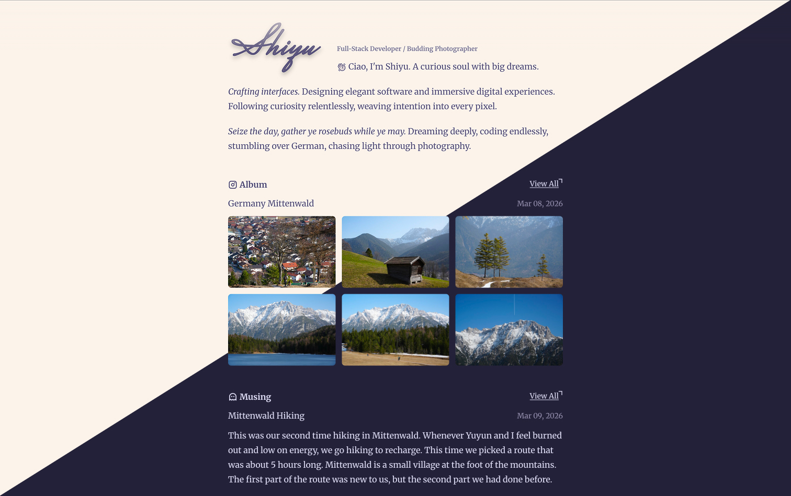

# Zero

My cozy corner on the Internet.

## Preview

<p align="center">
  
</p>

## Overview

- MDX content powered by Content Collections
- GitHub-powered data, RSS feed, sitemap, and OG image routes
- Theme switching and responsive layout

## Stack

- Next.js 16
- React 19
- TypeScript 5
- Tailwind CSS 4
- Content Collections

## Development

### Run locally

```bash
pnpm install
pnpm predev
pnpm dev
```

Open http://localhost:3000.

### Environment

```bash
GITHUB_TOKEN=your_github_token
```

## License

MIT
