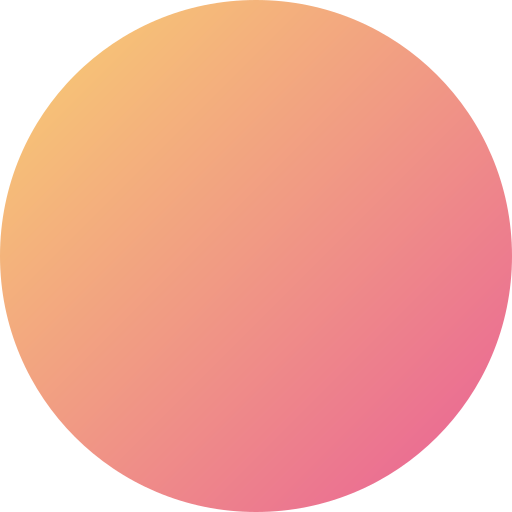

# Zero

<p align="center">
  
</p>

A personal blog and portfolio built with Next.js, React, TypeScript, and Tailwind CSS.

## Overview

- App Router blog and content site
- MDX content powered by Content Collections
- Journal, musings, craft notes, projects, and photo albums
- GitHub-powered data, RSS feed, sitemap, and OG image routes
- Theme switching and responsive layout

## Stack

- Next.js 16
- React 19
- TypeScript 5
- Tailwind CSS 4
- Content Collections + MDX

## Development

### Requirements

- Node.js 24+
- pnpm 10+
- `GITHUB_TOKEN` in `.env`

### Run locally

```bash
pnpm install
pnpm predev
pnpm dev
```

Open http://localhost:3000.

### Environment

```bash
GITHUB_TOKEN=your_github_token
```

### Useful commands

```bash
pnpm check
pnpm build
pnpm start
```

## Structure

```text
app/                 Next.js routes and API handlers
components/          Reusable UI components
lib/                 Config, content, API, and utility logic
public/assets/blog/  MDX content sources
scripts/             Local maintenance scripts
styles/              Global styles
```

## License

MIT
